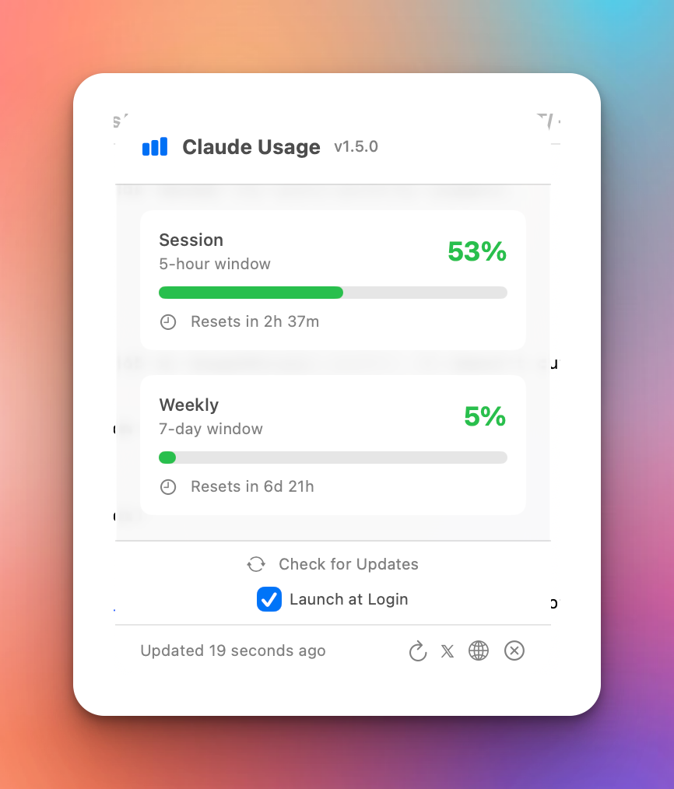

# Claude Usage

<p align="center">
  
</p>

A lightweight macOS menubar app that displays your Claude Code usage limits at a glance — and alerts you when a Claude Code session needs your attention.
<br><Br>
Built by [@richhickson](https://x.com/richhickson)

## Features

### Usage tracking
- 📊 **Session, Weekly & per-model limits** - including model-scoped weekly caps (e.g. Fable/Opus) as Anthropic rolls them out
- 💵 **Overage tracking** - extra-usage spend against your monthly limit
- 🚦 **Color-coded status** - Green (OK), Yellow (>70%), Red (>90%)
- ⏱️ **Time until reset** for each limit
- 🔄 **Auto-refresh** every 5 minutes, with retry on network/keychain hiccups and refresh on wake from sleep

### Session alerts (opt-in)
- 🔔 **Menu bar bell** with a count when Claude Code sessions are waiting for your permission or input
- 💬 **macOS notifications** when a session needs you - with an on/off toggle, permission status, and a test button
- 📋 **Live session list** in the popover: needs you 🔔 / working ⚙️ / finished ✅
- 🖱️ **Click-to-focus** - click a session (or its notification) to jump to the exact Terminal/iTerm2 tab it's running in; alerts clear once you've visited the session

### Claude status alerts
- 🌡️ **Outage notifications** - get notified when [status.claude.com](https://status.claude.com) reports a problem, and again when service recovers (checked every 5 minutes; toggle in settings)
- 🟢 **Status line in the popover** with a severity dot, linking to the status page

### Claude Code settings editor
- 📝 **Edit your global CLAUDE.md** - tell Claude Code how you like to work, from the app
- 🗓️ **Conversation retention** - set how long Claude Code keeps local transcripts (`cleanupPeriodDays`), preserving all your other settings

### Multi-account (`CLAUDE_CONFIG_DIR`)
- 👥 **Per-account usage, live and simultaneously** - if you run multiple Claude accounts via `CLAUDE_CONFIG_DIR` (e.g. `~/.claude-accounts/work`, `~/.claude-accounts/personal`), the app discovers each one automatically and shows its own session/weekly/model limits, independently, without needing an open `claude` session for either
- 🔔 **Session alerts per account** - the hooks and notifications above install into each account's own `settings.json`; alerts are labeled with the account name
- ⚙️ **Settings editor picks the account** - CLAUDE.md, retention, and session-alert toggles apply to whichever account is selected
- 🔁 **Falls back to single-account mode** automatically if `~/.claude-accounts/` doesn't exist - nothing changes for everyone else

### General
- ⬆️ **One-click in-app updates** - when a new version ships, click "Update & Relaunch" in the popover; the update's code signature is verified before installing
- 🚀 **Launch at Login** toggle
- 🪶 **Lightweight** - Native Swift, minimal resources, no frameworks

## Installation

### Download

1. Go to [Releases](../../releases)
2. Download `ClaudeUsage.zip`
3. Unzip and drag `ClaudeUsage.app` to your Applications folder
4. Open the app (you may need to right-click → Open the first time)

### Build from Source

```bash
git clone https://github.com/YOUR_USERNAME/claude-usage.git
cd claude-usage
open ClaudeUsage.xcodeproj
```

Then build with ⌘B and run with ⌘R.

## Requirements

- macOS 13.0 (Ventura) or later
- Claude Code CLI installed and logged in

## Setup

1. Install [Claude Code](https://claude.ai/code) if you haven't already:
   ```bash
   npm install -g @anthropic-ai/claude-code
   ```

2. Log in to Claude Code:
   ```bash
   claude
   ```
   
3. Launch Claude Usage - it will read your credentials from Keychain automatically

### Enabling session alerts (optional)

1. Click the menu bar icon → gear icon → toggle **Alert when a session needs attention**
2. This installs a small status hook into `~/.claude/settings.json` (pure POSIX sh, no dependencies; your existing settings and hooks are preserved, and toggling off removes it cleanly)
3. Allow **notifications** when prompted, and allow **"ClaudeUsage wants to control Terminal"** on your first click-to-focus - that's what jumps you to the right terminal tab
4. Hooks take effect for Claude Code sessions started (or resumed) after enabling

**Tip:** if you use macOS Focus modes, add ClaudeUsage to your Focus allowed apps or banners will be silenced.

## How It Works

Claude Usage reads your Claude Code OAuth credentials from macOS Keychain and queries the usage API endpoint at `api.anthropic.com/api/oauth/usage`.

Session alerts work via Claude Code's hooks system: a tiny shell script reports each session's status (working / needs attention / finished) to JSON sidecar files in `~/.claude/claudeusage/`, which the app watches. Everything stays on your machine.

**Note:** This uses an undocumented API that could change at any time. The app will gracefully handle API changes but may stop working if Anthropic modifies the endpoint.

### Multi-account credential lookup

When `CLAUDE_CONFIG_DIR` is set (e.g. by a shell function that runs `CLAUDE_CONFIG_DIR="$HOME/.claude-accounts/work" claude`), Claude Code stores that account's OAuth token under a Keychain item named `Claude Code-credentials-<hash>`, where `<hash>` is the first 8 hex characters of `SHA-256(<absolute path to CLAUDE_CONFIG_DIR>)` — e.g. `SHA-256("/Users/you/.claude-accounts/work")[:8]`. Claude Usage discovers accounts under `~/.claude-accounts/` and computes this hash per account to read each one's credentials independently.

This algorithm isn't documented by Anthropic — it was reverse-engineered by comparing calculated hashes against real Keychain item names, and could change in a future Claude Code release without notice. If a computed hash stops matching, the app shows a specific "no credential found" error for that account rather than crashing or silently showing stale data.

## Privacy

- Your credentials never leave your machine
- No analytics or telemetry
- No data sent anywhere except Anthropic's API
- Open source - verify the code yourself

## Status Colours

| Normal | Warning | Critical |
|--------|---------|----------|
| 🟢 30% | 🟡 75% | 🔴 95% |

## Troubleshooting

### "Not logged in to Claude Code"

Run `claude` in Terminal and complete the login flow.

### App doesn't appear in menubar

Check if the app is running in Activity Monitor. Try quitting and reopening.

### Usage shows wrong values

Click the refresh button (↻) in the dropdown. If still wrong, your Claude Code session may have expired - run `claude` again.

## Contributing

PRs welcome! Please open an issue first to discuss major changes.

## License

MIT License - do whatever you want with it.

## Disclaimer

This is an unofficial tool not affiliated with Anthropic. It uses an undocumented API that may change without notice.

---

Made by [@richhickson](https://x.com/richhickson)
